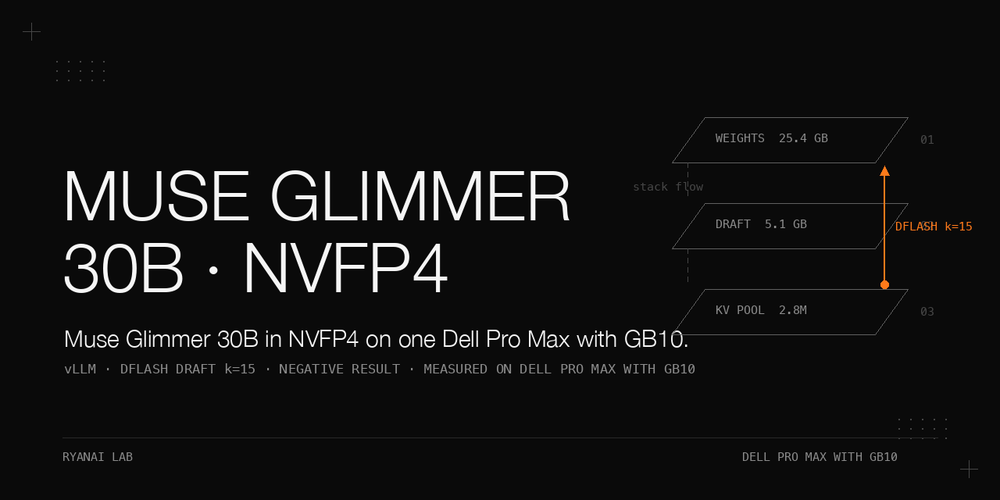

# Muse Glimmer 30B in NVFP4 on one Dell Pro Max with GB10 — a negative deployment result

> We deployed the open-weight member of the Muse family known to us at trial time, Muse Glimmer 30B (dense 29.6B including a ViT-G/14 1.8B vision tower), in NVFP4 W4A4 on a single Dell Pro Max with GB10, using the vLLM official recipe image with the DFlash speculative draft (`k=15`), and scored it against the DeepSeek V4 Flash Vision-Exp comparison baseline over our private 11-category eval bank (questions not published) with 2 runs per category, taking the median and adjudicating on the lower run whenever the spread exceeded 5. The static footprint is unusually comfortable (25.4 GB NVFP4 weights, a KV pool of 2,817,481 tokens at `max_model_len` 131,072), and the model produced the best scores of the whole comparison on vision (c6 90.0) and SRE-ops (c10 93.3) plus the best 6-stream aggregate (116.1 tok/s). But it failed five gates of the frozen rule set, and Δown sits in the tie zone, which is by itself insufficient to win. Verdict: negative result, production unchanged.

## Why this matters

This is a measured **negative** result, not a recommendation. A model that posts the best vision and SRE-ops scores of a five-column comparison, a KV pool of 2.8M tokens on one node, and the highest 6-stream aggregate can still lose a deployment decision if it fails five independent gates — here tool use, long coding, agentic-IF, raw decode speed, and wall clock against the reference. The point of the cookbook is the evidence: every number in the trial's own results tables comes from the trial, with its condition, and the five gates that failed are listed gate by gate rather than summarized away. Community/inventory numbers carried into the plan (see "Community / inventory numbers") are third-party or pre-trial figures and are labelled as such, not trial measurements. The one residual recommendation is a narrow one — an offline batch vision / SRE-Q&A lane — and it is stated as such, not promoted to a mainline role.

## Hardware and stack

**Node / hardware**

| Item | Value |
|---|---|
| Node class | Dell Pro Max with GB10, single node |
| Memory / OS / driver / CUDA / container runtime | not recorded in the sources |
| Weights format | NVFP4 W4A4, `Inferact/Muse-Glimmer-30B-NVFP4-W4A4`, **25.4 GB** (weights file size); revision / checksum / pull command not recorded |
| Draft model | `meta-models/Muse-Glimmer-30B-assistant`, **5.1 GB** (weights file size); revision / checksum not recorded |
| Model shape | Muse Glimmer 30B, dense **29.6B** params incl. **ViT-G/14 1.8B**; **52** layers; native `max_position_embeddings` **131072**, **no `rope_scaling`** (config / model card not published with this cookbook) |
| Alternative precision check | BF16 **59.55 GB** is a weights-size estimate (vision complete); not trial-measured and not verified to fit at runtime with KV + vision — inventory note |

**Image / flags actually launched**

| Item | Value |
|---|---|
| Image | `vllm/vllm-openai:muse-glimmer` (required for DFlash; official recipe marked DGX Spark verified). **No image digest is recorded in the sources**; vLLM version not recorded. Pull the tag and record your own digest — a mutable tag cannot rebuild this stack, and a reader-recorded digest cannot recover the original experiment. |
| Flags | `--speculative-config dflash k=15`; `--max-num-seqs 32`; `--generation-config auto` (**required**, else tool calls are truncated at `<|eom|>`); gmu 0.80; max ctx 131072. Only a flag summary is recorded; the full launch command, draft path, parser config, and the exact `--speculative-config` / gmu / max-ctx spelling are not recorded in the sources, so the command is not statically checkable here. |
| Launch route | No Muse recipe in the community cluster stack → launched via a private switch script's solo mode with an explicit image tag, or a bare `docker run`. The switch script is not in this repo; its behaviour is described below and its public abstraction is `switch/stack-mode.sh` in the sibling repo dell-pro-max-gb10-vllm-stack-ab. Inspection / rollback commands: `docker rm -f <container>`, `docker logs --tail 4000 <container>`. |
| Bank / grader versions | not published (private bank; see the reproducibility note at the end) |
| Eval condition | 2 runs per category, score = category mean ×100, median taken; spread >5 marked ⚠ and adjudicated on the lower run; t=0; tool-call parser = the model's official parser (`muse_glimmer`), parser differences count as part of deployment capability |
| Reasoning setting | Reasoning **cannot** be turned off on this deployment → system prompt `Reasoning strength: low`, reported as "thinking not disableable" with token/wall-clock columns. The model config / version proving "no off" is not recorded; treat as an observation of this deployment, not a general property of all same-named builds. |

**Community / inventory numbers carried into the plan (condition: Dell Pro Max with GB10 deployability inventory, 2026-09-17, before the trial; partly vendor-reported — not our trial measurements)**

| Item | Value | Source basis |
|---|---|---|
| Decode without draft | **11.7 tok/s** | inventory / classmethod figures |
| Decode with DFlash | **21.6 tok/s** | inventory / classmethod figures |
| Decode on SGLang + DFlash | **23.7 tok/s** | inventory (SGLang NVFP4 build has **no vision weights** on the build observed → vision categories score 0; speed reference only; specific build / weight manifest not recorded) |
| KV pool | **4.82M tokens** (no draft) / **3.58M** (with draft); ≈2.25× the Qwen3.6-27B pool of **2.14M** with no draft (4.82/2.14), ≈1.67× with draft (3.58/2.14) | inventory |
| 8-way concurrent aggregate | **159 tok/s** | inventory |
| Boot | **371 s** (compile + autotune + graph); range **371–411 s** in the recipe notes | inventory |
| Draft speed-up claim | "6 patches, 25→57 tok/s" (community forum claim) | third-party claim, **not reproduced by us** |
| Vendor/analyst scores | MCP Atlas **75.5**; τ3-Banking **23.5** (beats Qwen3.6-27B); loses SWE-V / TerminalBench; independent AA index **35** vs Qwen3.6-27B **38**; hallucination rate **82%** | inventory (third-party tables) |

Note on these figures: the speed, KV, concurrency, boot, patch and third-party ranking numbers above carry only a source label; the in-repo original text, versions and test conditions behind them are not recorded in the sources, so they cannot be independently verified from this cookbook. They are listed only as context that was carried into the plan.

Note on two decode numbers: the community/inventory DFlash figure is **21.6 tok/s** while our own K1 measurement in the trial was **27.1 tok/s**; both are listed, they are different measurements under different conditions (inventory/community run vs our K1 protocol run), neither is rounded or merged.

## How to reproduce

The steps below are the procedure as actually run, in order. Where a prerequisite is unknown or not recorded in the sources, that is stated explicitly rather than guessed.

1. Pre-stage the weights and image (25.4 GB NVFP4 + 5.1 GB draft + the `muse-glimmer` image) before the trial window. The exact image digest is not recorded in the sources — we cannot pin it here; pull `vllm/vllm-openai:muse-glimmer` and record your own digest.
2. Open a trial window on the single node via the private switch script's solo mode (behaviour: stop the running stack container, pull the trial image, launch it with the flags below; its public abstraction is `switch/stack-mode.sh` in the sibling repo dell-pro-max-gb10-vllm-stack-ab). No production-network topology, probe cadence, or fallback arrangement is recorded for this trial.
3. Start the container with the flags above: DFlash `k=15`, `--max-num-seqs 32`, gmu 0.80, `--generation-config auto`, max ctx 131072. The full launch command is not recorded (see the launch-flags table).
4. Declare readiness only on a real generation request with non-empty output (not `/health`); the recorded boot time was **520 s** (real request).
5. Run our private 11-category eval bank (questions not published) **twice**, t=0, with `Reasoning strength: low` because thinking cannot be disabled. The bank, grader and per-question transcripts are private (not published); only the aggregated category scores here are reproducible from the bank. Reader-side reproduction of the bank scores therefore requires the reader's own question set; a de-identified public protocol/example set is not provided with this cookbook. The 200K tier of c2 could not be served (native 131072 ctx, no `rope_scaling`) and was recorded **N/A** and removed from both sides of the mean, with a separate 20-question 32K/95K score.
6. Run the K1 speed protocol (decode / cold prefill / 6-stream aggregate) and record the engine's "GPU KV cache size" token count together with `max_model_len`. The K1 protocol's input/output lengths, repetition count, warm-up, cold-cache definition, timing boundary and concurrency scheduling are not recorded in the sources, so the decode / prefill / 6-stream figures cannot be reproduced by readers without that definition.
7. Record per-category median wall clock at parallel 4 from the runner log. The statistical object of the median (questions per category, failure/timeout handling, whether timing includes queueing or retries) is not recorded, nor is the relationship to the 900 s per-question budget.
8. Apply the frozen adjudication rules v2 in order (stability → key categories → other categories → performance gates → Δown tie zone → Muse-specific wall-clock gate) and write the verdict plus the five-column comparison table.
9. Roll the node back to the comparison stack after the window (via the same switch script's restore path; `docker rm -f <container>` and re-launch the baseline image).

## Results

### Eleven-category medians (2 runs per category; ⚠ = spread >5 → adjudicated on the lower run)

| category | DeepSeek V4 Flash VE (baseline B) | 27B (reference) | solo Flash-Next (P1) | dual Flash-Next (P2) | **Muse low (P3)** |
|---|---|---|---|---|---|
| c1-kbqa | 86.7 | 100.0 | 95.0 | 95.0 | **98.3** |
| c2-longctx | 90.0 ⚠(86.7/93.3) | 65.0 | 100.0 | 98.3 | **63.3** |
| c3-tool | 73.3 ⚠(70.0/76.7) | 66.7 | 86.7 ⚠(83.3/90.0) | 88.3 | **53.3** |
| c4-code | 87.5 | 95.8 | 91.7 ⚠(87.5/95.8) | 91.7 ⚠(87.5/95.8) | **95.8** |
| c5-extract | 92.1 | 89.3 | 91.1 | 90.6 | **88.2** |
| c6-vision | 81.2 | 80.0 | 87.5 | 87.5 | **90.0** |
| c7-zhif | 78.3 | 86.7 | 85.0 | 85.0 | **80.0** |
| c7-agentic-if | 95.0 | 80.0 | 87.5 | 85.0 ⚠(80.0/90.0) | **79.2** |
| c8-judgment | 76.7 ⚠(73.3/80.0) | 89.2 | 70.8 | 70.0 | **76.7** |
| c9-long-coding | 99.3 | 97.2 | 97.6 | 97.2 | **75.0 ⚠(66.7/83.3)** |
| c10-sre-ops | 83.3 ⚠(80.0/86.7) | 90.0 | 88.3 | 90.0 | **93.3** |
| c2 (32K/95K, 20 questions; 200K tier N/A, excluded) | 92.5 [85.0, 100.0] ⚠ | 97.5 [100.0, 95.0] | 100.0 [100.0, 100.0] | 97.5 [95.0, 100.0] | **95.0 [95.0, 95.0]** |
| own mean (8 categories, original basis) | 87.3 | 88.0 | 92.0 | 91.9 | **85.5** |
| pack mean (3 categories) | 81.7 | 78.6 | 81.7 | 81.1 | **69.7** |
| errors / cat-runs | 1 / 22 | 20 / 22 | 0 / 22 | 0 / 22 | **23 / 22** |

Conditions: c6 90.0 and c10 93.3 are the highest values across all five columns; c2's 63.3 reflects the 200K tier being unservable at native 131072 ctx (see "What did not work"), the 20-question 32K/95K figure is 95.0 [95.0, 95.0]; c9 median 75.0 with runs 66.7/83.3, adjudicated 66.7. The comparison columns (27B reference, solo/dual Flash-Next P1/P2, baseline B) are named here by their role; their full model revisions, precisions, images, launch flags and sampling/inference configs are not recorded in the sources, so the five-column comparison cannot be rebuilt as a fair match from this cookbook alone. The own/pack category membership is not recorded; the `own mean (8 categories, original basis)` and `pack mean (3 categories)` rows are reproduced from the trial's own basis, which is not published here.

### Speed, KV pool, boot (K1 protocol; boot = time to first real request)

| metric | DeepSeek V4 Flash VE (B) | 27B (ref) | solo Flash-Next (P1) | dual Flash-Next (P2) | **Muse low (P3)** |
|---|---|---|---|---|---|
| decode tok/s | 31.8 | 20.0 | 36.6 | 52.9 | **27.1** |
| cold prefill tok/s | 2085 | 1957 | 2144 | 2989 | **2822** |
| 6-stream aggregate tok/s | 81.2 | 88.0 | 56.6 | 91.8 | **116.1** |
| KV tokens @ `max_model_len` | 1,301,037 @ 1,048,320 | — | 1,134,794 @ 262,144 | 3,042,386 @ 262,144 | **2,817,481 @ 131,072** |
| boot s | — | — | 300 | 300 | **520** |

Conditions: KV figures across different ctx configurations are only comparable against absolute gates, not against each other (different `max_model_len` per column). The 6-stream aggregate 116.1 is the highest of the five columns. Boot 520 s (real request) vs the inventory/community figure 371 s (371–411 s) — both listed, different measurements.

### Median wall clock per category, seconds (runner-recorded, parallel 4)

| category | DeepSeek V4 Flash VE (B) | 27B (ref) | solo Flash-Next (P1) | dual Flash-Next (P2) | **Muse low (P3)** |
|---|---|---|---|---|---|
| c1-kbqa | 19 | 36 | 41 | 28 | **60** |
| c2-longctx | 1288 | 752 | 1594 | 1177 | **563** |
| c3-tool | 39 | 66 | 68 | 118 | **137** |
| c4-code | 10 | 85 | 19 | 12 | **75** |
| c5-extract | 42 | 52 | 51 | 34 | **142** |
| c6-vision | 18 | 19 | 22 | 179 | **145** |
| c7-zhif | 24 | 16 | 23 | 14 | **92** |
| c7-agentic-if | 43 | 70 | 78 | 210 | **254** |
| c8-judgment | 69 | 63 | 107 | 72 | **268** |
| c9-long-coding | 839 | 131 | 180 | 178 | **1033** |
| c10-sre-ops | 32 | 60 | 54 | 34 | **94** |

Conditions: the Muse wall-clock gate compares against the 27B reference (≤3×): c3-tool 137 s vs 66 s = ×2.1 ✓; c7-zhif 92 s vs 16 s = ×5.8 ✗; c10-sre-ops 94 s vs 60 s = ×1.6 ✓. The earlier "per-question wall clock of 2.5–4×" line was imprecise: the recorded wall-clock column holds per-category medians, not per-question ratios, and the per-category ratios against the baseline column vary widely across categories, so a single 2.5–4× per-question range is not supported by the recorded numbers.

### Gate-by-gate adjudication (frozen rules v2), Muse low (P3) vs the baseline

| gate | value vs threshold | result |
|---|---|---|
| stability | errors 23 (cat-runs 22), with the c2 200K tier recorded N/A (over-native-ctx) rather than error; records true errors 3/592 = **0.5%** (gate ≤1%); boot 520 s | reported with both counts (see "What did not work") |
| stability reproducibility note | the composition of the 592 denominator (whether N/A run-cats are excluded) and the two-round reconciliation (run 1 recorded 10 c2 errors; the second round's count is not recorded) are not recorded, so the 3/592 figure's stability across rounds is not verifiable here. No pass/fail verdict, boot-timeout ceiling, or probe record beyond the 520 s real-request boot is recorded. | not recorded |
| key c3-tool | 53.3 vs B 70.0 (gate ≥65.0) | ✗ |
| key c4-code | 95.8 vs B 87.5 (gate ≥82.5) | ✓ |
| key c8-judgment | 76.7 vs B 73.3 (gate ≥68.3) | ✓ |
| key c9-long-coding | 66.7 vs B 99.3 (gate ≥94.3) | ✗ |
| c1-kbqa | 98.3 vs 86.7 (gate ≥76.7) | ✓ |
| c2-longctx | 95.0 vs B 85.0 (adjudicated low; 92.5 [85.0, 100.0], spread 15 >5) (gate ≥75.0) | ✓ |
| c5-extract | 88.2 vs 92.1 (gate ≥82.1) | ✓ |
| c6-vision | 90.0 vs 81.2 (gate ≥71.2) | ✓ |
| c7-zhif | 80.0 vs 78.3 (gate ≥68.3) | ✓ |
| c7-agentic-if | 79.2 vs 95.0 (gate ≥85.0) | ✗ |
| c10-sre-ops | 93.3 vs 80.0 (gate ≥70.0) | ✓ |
| decode | 27.1 (gate ≥30) | ✗ |
| prefill | 2822 (gate ≥1000) | ✓ |
| 6-stream | 116.1 (gate ≥60) | ✓ |
| KV | 2,817,481 (gate ≥1,000,000) | ✓ |
| Δown (common categories, c2 on the 20-question basis) | 88.4 − 87.2 = **+1.2** → tie zone | tie zone, not a win |
| Δown reproducibility note | the own/pack category membership, weights and the averaging formula are **not recorded** in the sources; the published 88.4 / 87.2 cannot be rebuilt from the category table here, and applying the spread>5 low-run rule to c2 (B 85.0) and c9 (P3 66.7) would change the Δown value — the corrected value is not recorded. The tie-zone numeric bounds (boundary, inclusivity of equality, rule version) are also not recorded, so whether +1.2 falls inside the tie zone is taken from the trial's own verdict, not recomputable here. The tie-zone's "KV ≥ B" condition is read against each column's absolute KV gate, not as a cross-configuration comparison (KV across different `max_model_len` is not comparable, see the speed-table note). | not recorded |
| Muse wall-clock gate | c7-zhif ×5.8 (92 s vs 16 s; 92÷16=5.75→5.8) (gate ≤3×) | ✗ |
| conclusion | negative result; production unchanged | |

### Diagnostic breakdown of the c3 failure (single-run breakdown)

Tool Selection 1/3, Multi-Step 2/5, Restraint 2/2, Error Recovery 2/3 — weakness is in tool selection and multi-step chains, not in restraint. (Single-run breakdown; does not reconstruct the two-round c3 median of 53.3; the run, weights and second-round scores are not recorded.)

Full tables with per-table measurement notes are in `docs/results.md`.

## What did not work

- **Five gates failed → negative result, dropped from production candidacy.** c3-tool 53.3 (gate ≥65.0); c9-long-coding 66.7 adjudicated (runs 66.7/83.3, gate ≥94.3); c7-agentic-if 79.2 (gate ≥85.0); decode 27.1 tok/s (gate ≥30); c7-zhif wall clock 92 s vs 27B 16 s = ×5.8 (gate ≤3×). Δown +1.2 (as recorded by the trial) sits in the tie zone and was by itself insufficient to win; see the Δown reproducibility note for what is not recorded.
- **c2 long-context at the 200K tier is unservable**: native `max_position_embeddings` 131072 with no `rope_scaling`; launching at 131072 was already the native ceiling; all ten 200K questions (IDs in the 020–029 range) failed on run 1 with `errors=10`, and the raw c2 score fell to 63.3; per the common-category rule the 200K tier was recorded **N/A and excluded from both sides**, leaving the 32K/95K 20-question figure of 95.0 [95.0, 95.0].
- **Reasoning cannot be disabled**: even with `Reasoning strength: low` the model emitted 5–10× the tokens of the comparison baseline (a recorded observation; per-question token counts, the corresponding baseline, the counting range and the output ceiling are not recorded, so the multiple is not verifiable from this cookbook alone and non-disableable reasoning is not independently proven to be the sole cause of the timeouts). Three c9 questions hit the 900 s per-question budget with outputs of 21–26K tokens.
- **Error accounting disagreement between two sources (listed, not merged)**: the comparison table records `errors / cat-runs` = **23 / 22** for P3, while the records show true errors **3/592 = 0.5%** (within the ≤1% stability gate). The adjudication line reconciles this by stating that the c2 200K-tier errors were recorded as N/A rather than errors; the two figures come from different post-processing of the same runs.
- **Decode below gate despite DFlash**: 27.1 tok/s (gate ≥30) with the assistant draft at `k=15`; the community claim "25→57 tok/s with DFlash" and the inventory figures 11.7 (no draft) / 21.6 (DFlash) / 23.7 (SGLang) are third-party or pre-trial numbers and were not reproduced at the claimed level.
- **SGLang speed backup lane is disqualified for quality work**: the SGLang NVFP4 build observed here has no vision weights → vision categories score 0 (recorded from the inventory note; the specific weights, build version and manifest, and a vision-0 result from this trial, are not recorded, so it is not generalised to all same-named builds); usable only as a speed reference.
- **Independent third-party metrics were weak**: AA index 35 (vs Qwen3.6-27B 38), hallucination rate 82%, τ3-Banking 23.5; loses SWE-V / TerminalBench (inventory, vendor/analyst tables).
- **Dual-node operation was not tested for this model**: the inventory notes that a single node already yields the 4.82M-token KV pool; no throughput, latency or reliability comparison of single- vs dual-node for this model is recorded, so dual-node was a choice left untested under the capacity requirement of the trial, not a measured verdict that dual-node is pointless.
- **Boot cost**: 520 s to a real request in the trial (vs the inventory/community 371 s, 371–411 s), eating window budget.
- **What did hold up**: c6-vision 90.0 and c10-sre-ops 93.3 were the best of all five columns, and the 6-stream aggregate 116.1 tok/s was also the highest — the residual recommendation is an offline batch vision / SRE-Q&A lane (a candidate use, not validated by a batch-vision / SRE-Q&A throughput, error or acceptance run in this cookbook), not agent mainline.

## Pitfalls

Each pitfall is expanded with symptom / root cause / fix / how we found it in `docs/pitfalls.md`. Summary:

| symptom | root cause | fix |
|---|---|---|
| tool calls truncated mid-call | missing `--generation-config auto` (output cut at `<|eom|>`) | always pass `--generation-config auto` (observed on this deployment; the image/flag version and a request/response pair are not recorded, so the fix is not independently verified here) |
| thinking still verbose with reasoning set to low | reasoning cannot be turned off on this deployment (`low/medium/high/xhigh`, no off) → 5–10× tokens (not independently verified; no model config/version recorded) | no fix; report per-question wall clock/tokens alongside scores and treat it as a deployment-surface limitation |
| `tool_choice: required` returns 0 tool calls silently | vLLM behavior on this model (vLLM revision, tools/schema, parser/request params and the raw response are not recorded; only the zero-call symptom was detected, so `required` semantics are not confirmed fixed, only detected) | do not rely on `required`; validate call counts in the harness |
| all 200K-tier long-context questions fail | native `max_position_embeddings` 131072, no `rope_scaling`; `--max-model-len 131072` is already the ceiling | record as N/A and exclude the tier from both sides of the mean (never score it 0) |
| three c9 questions hit the 900 s per-question budget with 21–26K-token outputs | non-disableable reasoning inflates output length (hypothesis; not a coding-ability failure by the trial's frozen-budget result, but no relaxed-budget correctness retest or paired control is recorded) | budget per-question timeouts against reasoning-inflated outputs before comparing wall clock |
| vision categories all 0 on the SGLang speed build | SGLang NVFP4 build observed ships no vision weights (specific build/manifest not recorded; vision-0 evidence from this trial not recorded) | use the vLLM NVFP4 build for quality runs; use llama.cpp + mmproj (3/3 correct, 15 s startup — not reproducible: no llama.cpp commit, GGUF/mmproj file, command or test inputs recorded) only as a vision cross-check |
| "25→57 tok/s with DFlash" doesn't match our decode | community/forum claim, different patches and stack (the six patches and the community config are not recorded, so the gap is not confirmed caused by those factors) | never carry community speed numbers into gates; re-measure with the K1 protocol |
| KV pools look comparable across configurations | different `max_model_len` per run (131072 vs 262144 vs 1048320) | compare KV tokens only against absolute gates, record `max_model_len` with every KV number |
| no recipe exists for this model in the community cluster stack | recipe gap (the cluster stack repo, version and recipe list are not recorded, so the scope/time-point of "no recipe" is not verified) | launch solo with an explicit image tag via the switch script's solo mode (public abstraction: `switch/stack-mode.sh` in dell-pro-max-gb10-vllm-stack-ab; `docker rm -f`, `docker logs --tail 4000`), or a bare `docker run` |
| first real request takes far longer than "started" | boot measured to first true non-empty generation (520 s), not `/health` | gate readiness on a real request and log boot seconds in the evidence set |

## Files

- `README.md` — this cookbook.
- `docs/results.md` — all tables from the trial, with a one-line measurement-condition note above each.
- `docs/pitfalls.md` — the pitfalls expanded (symptom / root cause / fix / how we found it).
- `docs/make_banner.py` — pure-PIL banner generator (writes `docs/assets/banner.png`); run it to regenerate the banner. Requires Pillow: install with `pip install Pillow` and run `python3 docs/make_banner.py`; see the script header for the font-fallback note.

**Reproducibility scope.** Engine-level measurements (decode / prefill / 6-stream / KV / boot with the published flags) are reproducible by readers with the same image and flags; the private-bank category scores are reported only — the question texts, gold answers, per-question transcripts, the bank/grader identifiers, and the frozen gate/threshold table are intentionally **not** published. (The category names c1-kbqa … c10-sre-ops and the method are public; only the bank contents and the threshold table are withheld.)

## License

Apache-2.0.
